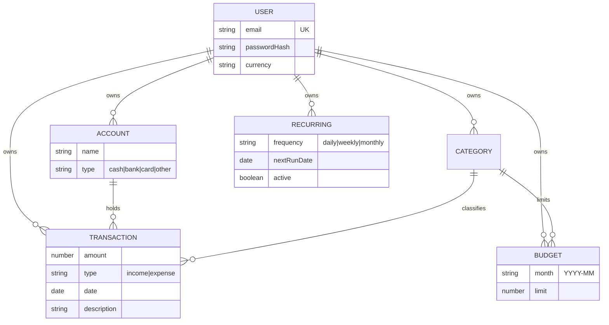

# Money Tracker

A personal finance tracker built with the MERN stack — multi-account ledger, per-category budgets, recurring transactions, and spending analytics.

> **Live demo:** _add your deployed URL here_


---

## Features

- **Accounts** — track cash, bank and card accounts separately; balances are derived from transactions, never stored
- **Transactions** — full ledger with search, filtering by type/account/category/date range, and server-side pagination
- **Categories** — income and expense categories with automatic icon and colour assignment
- **Budgets** — monthly spending limits per category, with spend computed live from transactions and month-to-month navigation
- **Recurring transactions** — daily, weekly or monthly schedules generated by a background job, with catch-up for missed occurrences
- **Analytics** — category breakdown and a six-month income/expense trend, aggregated in MongoDB
- **Multi-currency display** — eight currencies, formatted with `Intl.NumberFormat`
- **JWT authentication** — bcrypt password hashing, per-user data isolation enforced at the query level

---

## Tech stack

| Layer | Choice |
|---|---|
| Frontend | React 19, TypeScript, Vite, Tailwind CSS v4, React Router, Recharts |
| Backend | Node.js, Express, TypeScript (ESM) |
| Database | MongoDB with Mongoose |
| Auth | JWT (`jsonwebtoken`) + bcrypt |
| Scheduling | `node-cron` |
| Testing | Vitest, Supertest, `mongodb-memory-server` |
| CI | GitHub Actions |

---

## Data model



Account balances, budget spend and all analytics are **derived** from transactions via aggregation rather than stored as columns — so they can never drift out of sync when a transaction is edited or deleted.

---

## Getting started

**Prerequisites:** Node.js 20+, and a MongoDB database (a free [Atlas](https://www.mongodb.com/cloud/atlas) cluster works).

```bash
git clone https://github.com/Isiri-gallage/money-tracker-mern.git
cd money-tracker-mern
```

**Backend**

```bash
cd server
npm install
cp .env.example .env
```

Fill in `MONGODB_URI` and `JWT_SECRET` in `server/.env`, then:

```bash
npm run dev
```

The API starts on http://localhost:4000.

**Frontend** — in a second terminal:

```bash
cd client
npm install
npm run dev
```

The app starts on http://localhost:5173. Register an account and you're in — a default "Cash" account is created automatically.

---

## Scripts

**`server/`**

| Command | Description |
|---|---|
| `npm run dev` | Start with hot reload (`tsx watch`) |
| `npm run build` | Compile TypeScript to `dist/` |
| `npm start` | Run the compiled build |
| `npm test` | Run the test suite |

**`client/`**

| Command | Description |
|---|---|
| `npm run dev` | Start the Vite dev server |
| `npm run build` | Typecheck (`tsc -b`) and build for production |
| `npm run lint` | Run ESLint |
| `npm run preview` | Preview the production build locally |

> Note: run `npm run build` rather than `npx tsc --noEmit` to typecheck the client. Vite's `tsconfig.json` uses project references with `"files": []`, so a bare `tsc --noEmit` silently checks nothing.

---

## Testing

```bash
cd server
npm test
```

67 tests across 7 suites. Each suite spins up an in-memory MongoDB instance (`mongodb-memory-server`) and drops the database between tests, so runs are isolated and need no external database.

Coverage focuses on the things most likely to break:

- **Authorisation** — every resource has a test proving one user cannot read or delete another user's data
- **Pagination edges** — defaults, last-page remainders, the `limit` cap, and junk query values
- **Search safety** — regex metacharacters in a search term are escaped rather than executed
- **Recurring generation** — catch-up when occurrences were missed, no double-charging on re-runs, and month-end clamping (31 Jan → 28 Feb, not 3 Mar)
- **Aggregation correctness** — budget spend and analytics respect month boundaries and exclude income from spending breakdowns

---

## API

All routes except `/api/health`, `/api/auth/register` and `/api/auth/login` require an `Authorization: Bearer <token>` header.

| Method | Endpoint | Description |
|---|---|---|
| `POST` | `/api/auth/register` | Create an account (also creates a default Cash account) |
| `POST` | `/api/auth/login` | Exchange credentials for a JWT |
| `GET` `PATCH` | `/api/auth/me` | Read or update the current user (currency) |
| `GET` `POST` `DELETE` | `/api/accounts` | Accounts, returned with derived balances |
| `GET` `POST` `DELETE` | `/api/categories` | Categories |
| `GET` `POST` `DELETE` | `/api/transactions` | Transactions — supports `page`, `limit`, `from`, `to`, `type`, `categoryId`, `accountId`, `q` |
| `GET` | `/api/transactions/summary` | Income, expense and balance totals |
| `GET` `POST` `DELETE` | `/api/budgets` | Budgets for a month, with spend and remaining |
| `GET` | `/api/stats/overview` | Category breakdown and six-month trend |
| `GET` `POST` `PATCH` `DELETE` | `/api/recurring` | Recurring transaction rules |

---

## Deployment

The frontend is a static bundle and the backend is a Node service, so they deploy separately.

**Backend** (Render, Railway, Fly.io, …)

- Root directory: `server`
- Build command: `npm install && npm run build`
- Start command: `npm start`
- Environment variables: `MONGODB_URI`, `JWT_SECRET`, `CLIENT_ORIGIN` (your deployed frontend URL)

**Frontend** (Vercel, Netlify, Cloudflare Pages, …)

- Root directory: `client`
- Build command: `npm run build`
- Output directory: `dist`
- Environment variable: `VITE_API_URL` — your deployed API URL including `/api`

Also add your deployment's outbound IPs to the MongoDB Atlas network access list.

---

## Engineering notes

A few decisions worth explaining:

**Derived values over stored ones.** Account balances and budget spend are computed with MongoDB aggregation on read rather than incremented on write. Slightly more work per request, but it removes an entire category of bug — a stored balance drifting out of sync after a failed write or a deleted transaction.

**Analytics aggregate server-side.** The charts originally computed from the transaction list in the browser. Once pagination capped responses at 100 rows, that would have silently produced wrong totals for anyone with more history. `/api/stats/overview` uses `$group` and `$dateToString` so the numbers stay correct at any scale.

**Recurring catch-up.** The scheduler advances a rule in a `while` loop, not a single `if`. If the server is down for three days, a daily rule generates all three missed transactions rather than collapsing them into one. Month arithmetic clamps to the last valid day, so a rule set on 31 January lands on 28 February instead of rolling into March.

**Ownership enforced in the query, not in a check.** Deletes and updates filter on `{ _id, user: req.userId }` rather than fetching first and comparing. A missing record and someone else's record are indistinguishable from the outside — both return 404.

**Search input is escaped.** Query strings feed a MongoDB `$regex`, so metacharacters are escaped before use; otherwise a search for `.*` would match every row.

---

## Roadmap

- Editing existing transactions (currently create and delete only)
- Transfers between accounts
- CSV import/export
- Receipt attachments
- Frontend component and end-to-end tests
- Rate limiting and security headers
